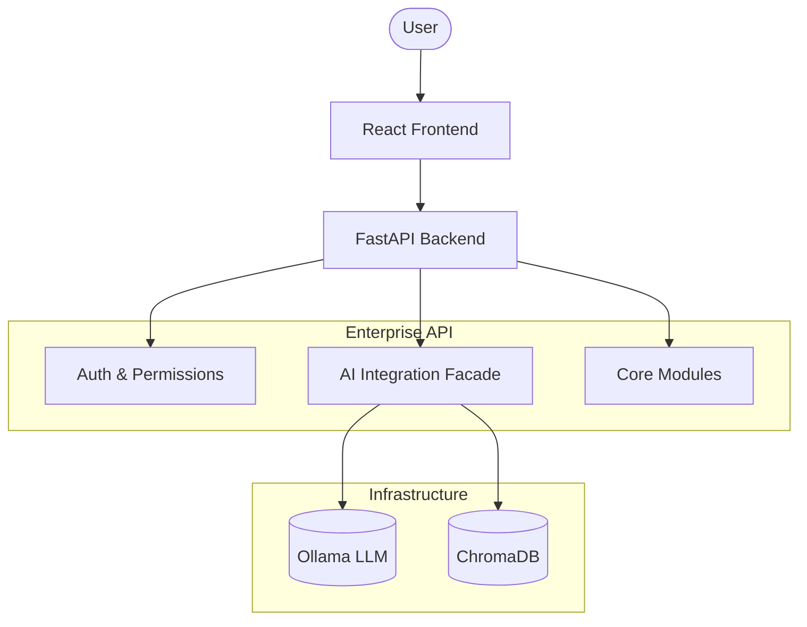
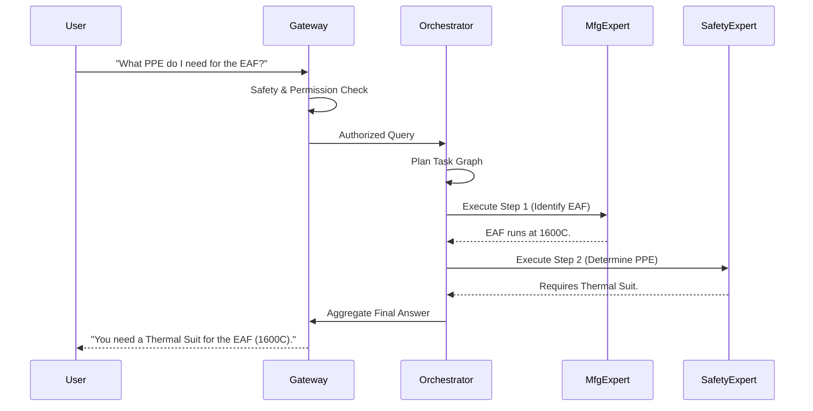
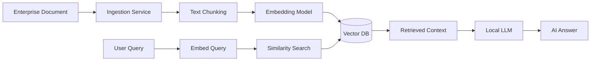
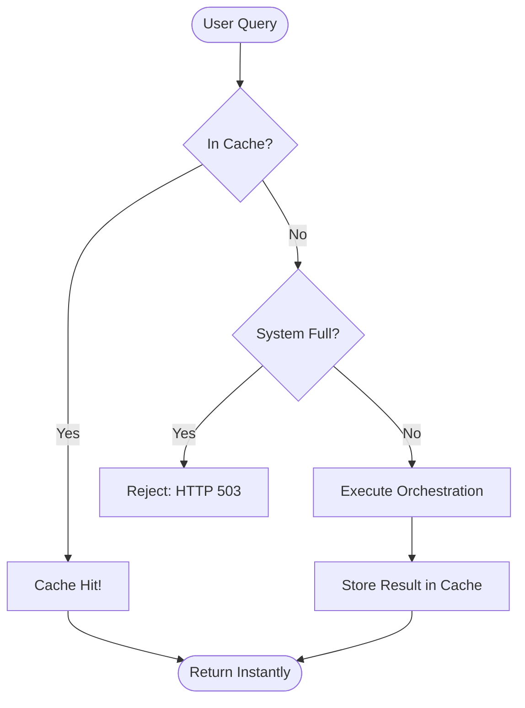

# Architecture Diagrams

## 1. Overall System Architecture

```mermaid
graph TD
    User([User]) --> Frontend[React Frontend]
    Frontend --> API[FastAPI Backend]
    
    subgraph Backend [Enterprise API]
        Auth[Auth & Permissions]
        AI_Facade[AI Integration Facade]
        Core[Core Modules]
    end
    
    API --> Auth
    API --> AI_Facade
    API --> Core
    
    subgraph Infrastructure
        Ollama[(Ollama LLM)]
        Chroma[(ChromaDB)]
    end
    
    AI_Facade --> Ollama
    AI_Facade --> Chroma
```

## 2. Multi-Agent AI Orchestration

```mermaid
sequenceDiagram
    participant User
    participant Gateway
    participant Orchestrator
    participant MfgExpert
    participant SafetyExpert
    
    User->>Gateway: "What PPE do I need for the EAF?"
    Gateway->>Gateway: Safety & Permission Check
    Gateway->>Orchestrator: Authorized Query
    
    Orchestrator->>Orchestrator: Plan Task Graph
    Orchestrator->>MfgExpert: Execute Step 1 (Identify EAF)
    MfgExpert-->>Orchestrator: EAF runs at 1600C.
    
    Orchestrator->>SafetyExpert: Execute Step 2 (Determine PPE)
    SafetyExpert-->>Orchestrator: Requires Thermal Suit.
    
    Orchestrator->>Gateway: Aggregate Final Answer
    Gateway-->>User: "You need a Thermal Suit for the EAF (1600C)."
```

## 3. RAG Knowledge Pipeline

```mermaid
graph LR
    Doc[Enterprise Document] --> Ingestion[Ingestion Service]
    Ingestion --> Chunking[Text Chunking]
    Chunking --> Embed[Embedding Model]
    Embed --> Chroma[(Vector DB)]
    
    Query[User Query] --> EmbedQuery[Embed Query]
    EmbedQuery --> Search[Similarity Search]
    Search --> Chroma
    Chroma --> Context[Retrieved Context]
    Context --> LLM[Local LLM]
    LLM --> Answer[AI Answer]
```

## 4. Conversation & Caching Flow

```mermaid
graph TD
    Query([User Query]) --> Cache{In Cache?}
    
    Cache -- Yes --> Hit[Cache Hit!]
    Hit --> Return([Return Instantly])
    
    Cache -- No --> Queue{System Full?}
    
    Queue -- Yes --> Reject[Reject: HTTP 503]
    Queue -- No --> Exec[Execute Orchestration]
    Exec --> StoreCache[Store Result in Cache]
    StoreCache --> Return
```
